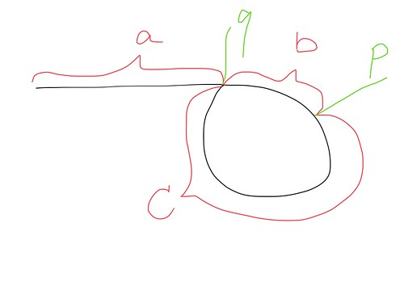

# LinkedList

### 141. Linked List Cycle
ListNode인 head가 주어졌을 때 Cycle이 존재하는지 확인하는 문제입니다. 
[문제풀이코드](https://github.com/hanbee1005/AlgorithmStudy/blob/master/Leetcode/202301/LinkedListCycle_141.java)
- 토끼와 거북이 알고리즘을 응용하면 됩니다.
- 주어진 노드를 `fast`와 `slow`에 옮겨 담습니다.
- `fast` 노드는 2씩 움직이고 `slow` 노드는 1씩 움직입니다.
- 싸이클이 존재한다면 `fast`와 `slow`는 싸이클에 빠져서 무한히 반복되고, `fast` 노드가 `slow` 노드보다 1씩 빠르기 때문에 거리가 1씩 줄어들어 언젠가는 만나게 됩니다. (리턴 `true`)
- 만약 앞서 나가던 `fast` 노드가 (`null`이 되거나) `null`을 마주친다면 싸이클이 존재하지 않아 `false`를 리턴하게 됩니다.

### 142. Linked List Cycle II
ListNode인 head가 주어졌을 때 Cycle의 시작인 노드를 찾아 반환하는 문제입니다.
[문제풀이코드](https://github.com/hanbee1005/AlgorithmStudy/blob/master/Leetcode/202301/LinkedListCycleII_142.java)
- 초기에는 노드를 하나씩 이동하면서 `Set`에 담고 현재 노드가 `Set`에 있는 경우 이를 반환하도록 구현하였습니다. 하지만 다른 풀이도 확인하여 다음과 같이 해결할 수 있음을 확인하였습니다.
- 플로이드의 순환 탐색 알고리즘(Floyd's cycle detection algorithm)을 이용한 방법입니다.
	+ fast와 slow 포인터가 점 p에서 만날 때 그들이 달린 길이는 'a+2b+c'와 'a+b'이고 fast가 2배 빠르게 이동하기 때문에 a+2b+c == 2(a+b)가 됩니다. 최종적으로 우리는 'a==c'를 얻을 수 있습니다.
	+ slow포인터와 fast 포인터를 이동하면서 최초 만나는지점 p를 찾아냅니다.
	+ slow포인터를 head 로 위치시킵니다.
	+ slow포인터와 fast포인터를 동시에 한칸씩 전진하며 만나는지점 q를 찾아 반환합니다.
		- 시간 복잡도 : O(N)
		- 공간 복잡도 : O(1)

### 83. Remove Duplicates from Sorted List
ListNode인 head가 주어졌을 때 중복된 val가 제거된 연결 리스트를 반환하는 문제입니다. 
[문제풀이코드](https://github.com/hanbee1005/AlgorithmStudy/blob/master/Leetcode/202301/RemoveDuplicatesFromSortedList_83.java)
- 정렬된 리스트이기 때문에 앞뒤 노드의 값만 비교하여 값이 같으면 현재 노드의 next 를 다음 노드의 next로 변경하여 중복된 노드와의 연결을 끊을 수 있도록 하였습니다.

### 82. Remove Duplicates from Sorted List II
ListNode인 head가 주어졌을 때 중복된 val가 모두 제거된 연결 리스트를 반환하는 문제입니다. 
[문제풀이코드](https://github.com/hanbee1005/AlgorithmStudy/blob/master/Leetcode/202301/RemoveDuplicatesFromSortedListII_82.java)
- 풀이...

